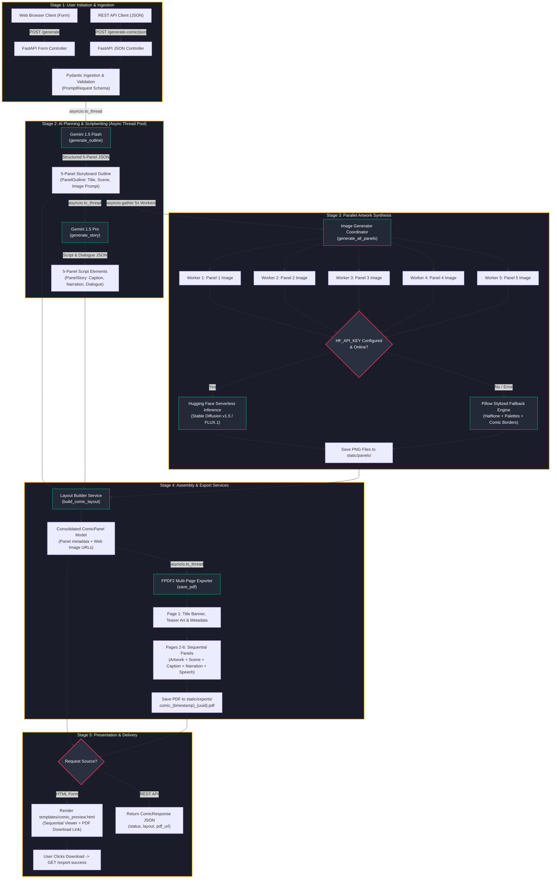
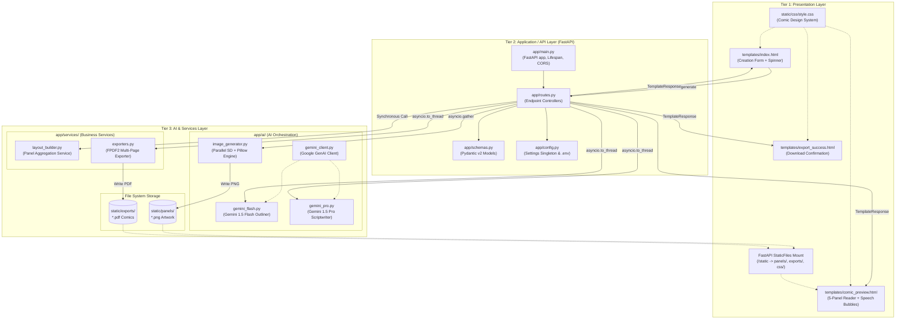

# ComicCraft: Milestone 1 & 2 Deliverables Report
**Project Workflow & Application Architecture (Stories 2 and 4)**

* **Author:** Syed Afridi N
* **Project Name:** ComicCraft — AI Comic Story Creator using Gemini Models
* **Framework:** FastAPI (Python 3.10+) | Google Gemini AI | Hugging Face Diffusers / Stable Diffusion | FPDF2 | Jinja2
* **Repository/Workspace:** `D:\Comic_Craft`
* **Coverage:** Milestone 1 (Model Selection & Architecture) & Milestone 2 (Core Functionalities Development)

---

## Executive Summary

**ComicCraft** is an automated generative AI web application that transforms user narrative prompts into personalized, cohesive 5-panel comic books complete with illustrations, character dialogues, narrative captions, an interactive web reader, and a downloadable publication-grade multi-page PDF document.

This report establishes the complete documentation for **Story 2 (Project Workflow)** and **Story 4 (Define the Architecture of the Application)**. It maps the developmental lifecycle across all 5 milestones and 13 activities, models the operational prompt-to-PDF lifecycle using both Mermaid and ASCII diagrams, specifies the full 3-tier architecture with concrete data contracts, explains key engineering design rationales (asynchronous thread offloading, multi-model fallback, and security boundaries), and supplies copy-paste-ready submission text boxes tailored for the SkillWallet evaluation portal.

---

# SECTION 1: STORY 2 — PROJECT WORKFLOW

## 1.1 Overview & Objective

The objective of Story 2 is to formalize the end-to-end operational roadmap of ComicCraft. The platform automates what has traditionally been an expensive, multi-disciplinary creative pipeline—story planning, scriptwriting, character dialogue formulation, visual art synthesis, panel composition, and print formatting—into a unified, deterministic, and highly responsive workflow.

The workflow spans five progressive developmental milestones containing thirteen discrete activities that transition the system from architectural research to core functional engineering, routing integration, dynamic UI presentation, and verified local deployment.

---

## 1.2 End-to-End Milestone & Activity Mapping (Milestones 1–5, Activities 1–13)

The following structure outlines the developmental roadmap of ComicCraft, detailing the objectives, technical tasks, inputs, and outputs of every activity.

```
========================================================================================================
                                     COMICCRAFT MILESTONE MAP
========================================================================================================
[ Milestone 1: Model Selection & Architecture ]
  ├── Activity 1  (1.1): Research and Select the Appropriate Generative AI Models
  ├── Activity 2  (1.2): Define the Architecture of the Application
  └── Activity 3  (1.3): Set up the Development Environment & Dependencies

[ Milestone 2: Core Functionalities Development ]
  ├── Activity 4  (2.1a): Develop Storyboard Outlining with Gemini 1.5 Flash
  ├── Activity 5  (2.1b): Develop Narrative Scriptwriting & Dialogue with Gemini 1.5 Pro
  ├── Activity 6  (2.1c): Develop Concurrent Comic Artwork Synthesis with Stable Diffusion & Fallbacks
  ├── Activity 7  (2.1d): Develop Panel Layout Builder Service
  ├── Activity 8  (2.1e): Develop Multi-Page PDF Exporter Service via FPDF2
  └── Activity 9  (2.2) : Implement FastAPI Backend Routing & Request Schemas

[ Milestone 3: routes.py Development & System Orchestration ]
  └── Activity 10 (3.1): Write Main Application Logic in routes.py with Async Thread Offloading

[ Milestone 4: Frontend Development ]
  ├── Activity 11 (4.1): Design & Develop Comic-Themed Responsive UI & Stylesheet
  └── Activity 12 (4.2): Create Dynamic Templates with FastAPI's Jinja2

[ Milestone 5: Deployment, Testing & Verification ]
  └── Activity 13 (5.1 & 5.2): Local Deployment Configuration, Uvicorn Execution & Test Verification
========================================================================================================
```

### Detailed Activity Breakdown

| Activity # | Milestone | Activity Name | Primary Module / File | Description & Technical Scope | Key Inputs & Outputs |
| :--- | :--- | :--- | :--- | :--- | :--- |
| **Activity 1** | **Milestone 1** | Research & Model Selection | `docs/`, `app/ai/gemini_client.py` | Benchmark LLMs and image synthesis engines for structured storytelling, prompt adherence, inference speed, and visual appeal. Selected Gemini 1.5 Flash (outlines), Gemini 1.5 Pro (narrative/dialogue), and Stable Diffusion v1.5 / FLUX.1 (illustrations). | **In:** Model specs, prompt benchmarks.<br>**Out:** Selected AI tech stack. |
| **Activity 2** | **Milestone 1** | Define Application Architecture | `technical_guide.md`, `app/` | Design modular 3-tier architecture dividing presentation (Jinja2/CSS), application/routing (FastAPI), and business/AI services (Gemini, Diffusers, FPDF). | **In:** Product requirements.<br>**Out:** 3-Tier architectural spec & directory hierarchy. |
| **Activity 3** | **Milestone 1** | Set Up Development Environment | `requirements.txt`, `.env.example`, `.gitignore` | Configure Python 3.10+ virtual environment (`venv`), install dependencies (`fastapi`, `uvicorn`, `fpdf2`, `pillow`, `google-generativeai`, `requests`), and configure environment keys. | **In:** Dependency specifications.<br>**Out:** Reproducible virtual runtime environment. |
| **Activity 4** | **Milestone 2** | Develop Storyboard Outlining | `app/ai/gemini_flash.py` | Implement `generate_outline()` using Gemini 1.5 Flash. Generates a strict 5-panel narrative arc (Setup, Inciting Incident, Conflict, Climax, Resolution) with panel titles, scene descriptions, and diffusion prompts. Includes dynamic mock fallback. | **In:** Story premise, character, setting, tone, style.<br>**Out:** 5-element `PanelOutline` JSON array. |
| **Activity 5** | **Milestone 2** | Develop Scriptwriting & Dialogue | `app/ai/gemini_pro.py` | Implement `generate_story()` using Gemini 1.5 Pro to expand each panel outline into ambient scene captions, narrative storytelling prose, and character dialogue formatted in comic speech syntax. Includes tone-aware fallback. | **In:** 5-panel outline, character name, tone.<br>**Out:** 5-element `PanelStory` JSON array. |
| **Activity 6** | **Milestone 2** | Develop Artwork Synthesis Engine | `app/ai/image_generator.py` | Implement `generate_image()` and `generate_all_panels()`. Connects to Hugging Face Serverless Inference API for Stable Diffusion v1.5 / FLUX, with a multi-palette Pillow procedural fallback rendering comic frames, banners, and wrapped prompts. | **In:** Image prompts, art style, panel IDs.<br>**Out:** 5 high-resolution PNG image paths on disk. |
| **Activity 7** | **Milestone 2** | Develop Panel Layout Builder | `app/services/layout_builder.py` | Implement `build_comic_layout()`. Merges outline metadata, narrative script, dialogue lines, and local image file paths into a cohesive, validated list of `ComicPanel` data structures with web-accessible URLs. | **In:** Outlines, story scripts, image paths.<br>**Out:** Consolidated `ComicPanel` layout dictionary list. |
| **Activity 8** | **Milestone 2** | Develop Multi-Page PDF Exporter | `app/services/exporters.py` | Implement `save_pdf()` using `fpdf2`. Generates a cover page with title banner and metadata, followed by 5 dedicated panel pages with centered artwork, italicized scene notes, ambient captions, narration boxes, and speech dialogue. Sanitizes unicode into safe Latin-1. | **In:** Comic layout, story metadata.<br>**Out:** Timestamped PDF file saved to `static/exports/`. |
| **Activity 9** | **Milestone 2** | Implement FastAPI Schemas & Config | `app/schemas.py`, `app/config.py` | Establish Pydantic v2 schemas (`PromptRequest`, `PanelOutline`, `PanelStory`, `ComicPanel`, `ComicResponse`) and singleton `Settings` class managing paths, API keys, and mock toggles. | **In:** Payload specifications.<br>**Out:** Validated data models and settings cache. |
| **Activity 10** | **Milestone 3** | Write Application Routing Logic | `app/routes.py`, `app/main.py` | Construct route controllers (`GET /`, `POST /generate`, `POST /generate-comic/json`, `GET /test-image`, `GET /export-success`). Offload synchronous AI and file generation to worker threads via `asyncio.to_thread` to preserve ASGI non-blocking execution. | **In:** HTTP requests, form submissions, JSON payloads.<br>**Out:** HTML template responses and JSON API responses. |
| **Activity 11** | **Milestone 4** | Design Responsive UI & Stylesheet | `static/css/style.css` | Create unified comic book stylesheet featuring dark canvas theme, golden/crimson accents, halftone dot patterns, responsive cards, speech bubbles with directional tails, and interactive loading spinner overlay. | **In:** Design system & aesthetic guidelines.<br>**Out:** Centralized `style.css` stylesheet. |
| **Activity 12** | **Milestone 4** | Create Dynamic Jinja2 Templates | `templates/index.html`, `templates/comic_preview.html`, `templates/export_success.html` | Develop dynamic templates bound to backend contexts: form submission interface with presets (`index.html`), sequential comic preview reader (`comic_preview.html`), and download confirmation page (`export_success.html`). | **In:** HTML specifications, layout context.<br>**Out:** Rendered server-side web pages. |
| **Activity 13** | **Milestone 5** | Local Deployment & Verification | `run.py`, `run.bat`, `tests/` | Configure local ASGI server execution using Uvicorn with hot reloading, verify interactive Swagger API docs (`/docs`), and validate end-to-end automated test suite across all modules with Pytest. | **In:** Application server script, test suite.<br>**Out:** 100% passing tests (64 passed) & live local server. |

---

## 1.3 Operational Lifecycle Flowchart: Prompt-to-PDF Execution Flow

The operational lifecycle of ComicCraft represents a deterministic, 7-stage pipeline. The user initiates execution through either the browser form (`POST /generate`) or the REST API (`POST /generate-comic/json`). The backend coordinates AI planning, script generation, parallel artwork synthesis, layout compilation, and PDF rendering before delivering the final assets.

### Mermaid Flowchart



### ASCII Art Flowchart

```
+---------------------------------------------------------------------------------------------------+
|                                 COMICCRAFT OPERATIONAL LIFECYCLE                                  |
+---------------------------------------------------------------------------------------------------+

   [ Browser Client ]                     [ REST API Client ]
           │                                       │
     POST /generate                         POST /generate-comic/json
     (HTML Form Data)                       (JSON Payload)
           │                                       │
           ▼                                       ▼
  +─────────────────────────────────────────────────────────────+
  |              STAGE 1: Ingestion & Validation                |
  |  - FastAPI extracts: prompt, character_name, setting, tone, |
  |    and art_style                                            |
  |  - Pydantic schema validation via PromptRequest model       |
  +─────────────────────────────────────────────────────────────+
                                │
                                ▼
  +─────────────────────────────────────────────────────────────+
  |        STAGE 2: Storyboard Planning (Gemini 1.5 Flash)      |
  |  - Executed in worker thread: asyncio.to_thread             |
  |  - Model generates structured 5-panel narrative arc:        |
  |    1: Setup | 2: Discovery | 3: Conflict | 4: Climax | 5: Res|
  |  - Outputs validated List[PanelOutline] JSON                |
  |  * Fallback: Dynamic mock outline if offline/mock mode      |
  +─────────────────────────────────────────────────────────────+
                                │
                                ▼
  +─────────────────────────────────────────────────────────────+
  |        STAGE 3: Scriptwriting & Dialogue (Gemini 1.5 Pro)   |
  |  - Executed in worker thread: asyncio.to_thread             |
  |  - Generates for each panel:                                |
  |    * Ambient scene caption                                  |
  |    * Descriptive narration prose                            |
  |    * In-character dialogue: "Character: '...' "             |
  |  - Outputs validated List[PanelStory] JSON                  |
  |  * Fallback: Tone-matched mock narrative script             |
  +─────────────────────────────────────────────────────────────+
                                │
                                ▼
  +─────────────────────────────────────────────────────────────+
  |     STAGE 4: Parallel Artwork Synthesis (Stable Diffusion)  |
  |  - asyncio.gather spawns 5 concurrent tasks simultaneously   |
  |                                                             |
  |     [Panel 1]     [Panel 2]     [Panel 3]     [Panel 4]     [Panel 5]
  |         │             │             │             │             │
  |         ▼             ▼             ▼             ▼             ▼
  |    +───────────────────────────────────────────────────────────+
  |    | Primary: Hugging Face Serverless (SD v1.5 / FLUX.1)        |
  |    | Fallback: Pillow Procedural Engine (5 custom style palettes,|
  |    |           halftone dots, panel badges, prompt wrapping)   |
  |    +───────────────────────────────────────────────────────────+
  |         │             │             │             │             │
  |         ▼             ▼             ▼             ▼             ▼
  |     panel_1.png   panel_2.png   panel_3.png   panel_4.png   panel_5.png
  |     (All 5 images saved to disk in static/panels/ directory)   |
  +─────────────────────────────────────────────────────────────+
                                │
                                ▼
  +─────────────────────────────────────────────────────────────+
  |             STAGE 5: Layout Aggregation Service             |
  |  - app/services/layout_builder.py: build_comic_layout()     |
  |  - Merges outline, narrative text, dialogue, & image paths  |
  |  - Converts file system paths to web URLs (/static/panels/) |
  |  - Instantiates List[ComicPanel] Pydantic models            |
  +─────────────────────────────────────────────────────────────+
                                │
                                ▼
  +─────────────────────────────────────────────────────────────+
  |          STAGE 6: Publication-Grade PDF Compilation         |
  |  - app/services/exporters.py: save_pdf() via FPDF2          |
  |  - Sanitizes text to safe Latin-1 encoding                  |
  |  - Page 1 (Cover): Title banner, metadata box, preview art  |
  |  - Pages 2-6 (Panels 1-5):                                  |
  |    * Navy & gold panel title header bar                     |
  |    * Centered 160mm scaled artwork with black border frame  |
  |    * Italicized scene description (10pt Helvetica)          |
  |    * Amber ambient caption box with 1px border              |
  |    * Slate narration box with action description            |
  |    * Blue bordered character dialogue speech bubble         |
  |    * Custom footer: "ComicCraft - Page X of Y"              |
  |  - Saved to static/exports/comic_{timestamp}_{uuid}.pdf     |
  +─────────────────────────────────────────────────────────────+
                                │
                                ▼
  +─────────────────────────────────────────────────────────────+
  |            STAGE 7: Dynamic Presentation & Delivery         |
  |                                                             |
  |   If HTML Form Request:           If REST API Request:      |
  |   Renders comic_preview.html      Returns ComicResponse     |
  |   - Sequential panel viewer       - status: "success"       |
  |   - Dialogue speech bubbles       - story_title, character  |
  |   - "Download PDF" action link    - layout: [ComicPanel]    |
  |   - Redirects to /export-success  - pdf_url: download path  |
  +─────────────────────────────────────────────────────────────+
```

---

## 1.4 Step-by-Step Lifecycle Phase Details

1. **Phase 1: Input Ingestion & Schema Validation**
   - The user inputs their story idea via `templates/index.html` or submits a JSON payload to `/generate-comic/json`.
   - Fields captured: `prompt` (mandatory, minimum 3 characters), `character_name` (default: "Hero"), `setting` (e.g., "Enchanted Forest"), `tone` (e.g., "Dramatic"), and `art_style` (e.g., "Classic Comic Book").
   - Pydantic v2 automatically validates input types and populates defaults.
2. **Phase 2: Storyboard Planning via Gemini 1.5 Flash**
   - Dispatched to a worker thread using `asyncio.to_thread(generate_outline, ...)`.
   - The prompt is framed with a strict system instruction requiring a 5-panel dramatic structure: Setup, Inciting Incident, Escalation, Climax, and Resolution.
   - Response is parsed into JSON. If offline or if API calls fail, the resilient mock generator produces a dynamic outline incorporating the user's character and setting.
3. **Phase 3: Narrative Scripting & Dialogue via Gemini 1.5 Pro**
   - Dispatched to a worker thread using `asyncio.to_thread(generate_story, ...)`.
   - Takes the 5-panel outline and writes atmospheric captions, gripping narration prose, and character dialogue in speech bubble format (`Character: '...'`).
4. **Phase 4: Concurrent Artwork Synthesis**
   - `generate_all_panels()` spawns five parallel execution threads via `asyncio.gather`.
   - Each worker calls `generate_image()` with the panel's tailored prompt and style triggers.
   - If `HF_API_KEY` is provided, requests are sent to the Hugging Face Serverless Inference API (`runwayml/stable-diffusion-v1-5`).
   - If unauthenticated, rate-limited, or offline, the procedural Pillow generator creates high-contrast comic panels with double borders, panel banners, style tags, and wrapped text.
   - Images are saved as PNG files in `static/panels/`.
5. **Phase 5: Layout Binding & Model Assembly**
   - `build_comic_layout()` pairs outline data, narrative elements, and generated image paths by matching panel indices.
   - Converts local disk paths (`D:\Comic_Craft\static\panels\...`) into client-accessible web URLs (`/static/panels/...`).
6. **Phase 6: Multi-Page PDF Compilation**
   - `save_pdf()` runs in a worker thread, constructing a multi-page A4 document via `FPDF2`.
   - Sanitizes unicode typography (smart quotes, em-dashes, ellipses) to avoid Latin-1 font crashes.
   - Assembles a stylized dark-navy cover page and five sequential panel pages with bordered artwork and structured text containers.
   - Saves to `static/exports/comic_{timestamp}_{uuid}.pdf`.
7. **Phase 7: Presentation & Delivery**
   - The browser receives `templates/comic_preview.html`, presenting the full comic sequence with direct PDF download buttons and a redirect to `templates/export_success.html`.
   - API clients receive a validated `ComicResponse` JSON payload.

---

## 1.5 SkillWallet Submission Deliverable: Story 2

> ### [COPY-PASTE BOX FOR SKILLWALLET PORTAL: STORY 2]
>
> **Milestone 1 & 2 Deliverable — Story 2: Project Workflow**  
> **Student Name:** Syed Afridi N  
> **Project Title:** ComicCraft: AI Comic Story Creator using Gemini Models  
>
> **1. End-to-End Milestone & Activity Roadmap:**  
> The ComicCraft operational lifecycle is systematically divided into 5 progressive milestones and 13 technical activities:  
> * **Milestone 1: Model Selection & Architecture:**  
>   - *Activity 1 (1.1):* Generative AI Model Research & Selection (Gemini 1.5 Flash, Gemini 1.5 Pro, Stable Diffusion v1.5).  
>   - *Activity 2 (1.2):* Define Application 3-Tier Architecture (Presentation, Application, AI & Services).  
>   - *Activity 3 (1.3):* Environment Setup, Virtualenv, and Dependency Configuration (`requirements.txt`, `.env`).  
> * **Milestone 2: Core Functionalities Development:**  
>   - *Activity 4 (2.1a):* 5-Panel Storyboard Outlining with Gemini 1.5 Flash (`app/ai/gemini_flash.py`).  
>   - *Activity 5 (2.1b):* Scriptwriting, Captions & Dialogue Expansion with Gemini 1.5 Pro (`app/ai/gemini_pro.py`).  
>   - *Activity 6 (2.1c):* Concurrent Comic Artwork Synthesis via Stable Diffusion & Resilient Pillow Fallback (`app/ai/image_generator.py`).  
>   - *Activity 7 (2.1d):* Comic Panel Layout Builder Aggregation Service (`app/services/layout_builder.py`).  
>   - *Activity 8 (2.1e):* Multi-Page PDF Publication Exporter via FPDF2 (`app/services/exporters.py`).  
>   - *Activity 9 (2.2):* FastAPI Pydantic Request Schemas & Environment Settings (`app/schemas.py`, `app/config.py`).  
> * **Milestone 3: Routes & System Integration:**  
>   - *Activity 10 (3.1):* Main Application Logic in `routes.py` with Async Thread Offloading (`asyncio.to_thread`).  
> * **Milestone 4: Frontend Development:**  
>   - *Activity 11 (4.1):* Comic-Themed Responsive UI Design & Centralized CSS (`static/css/style.css`).  
>   - *Activity 12 (4.2):* Dynamic Template Binding with FastAPI Jinja2 (`index.html`, `comic_preview.html`, `export_success.html`).  
> * **Milestone 5: Deployment & Verification:**  
>   - *Activity 13 (5.1 & 5.2):* Local Uvicorn ASGI Server Deployment, Interactive Swagger Docs (`/docs`), and 100% Automated Test Suite Verification (64 Pytest unit & integration tests passing).  
>
> **2. Operational Lifecycle Summary:**  
> The generation pipeline executes across 7 discrete stages: (1) Request ingestion and Pydantic validation of user prompts; (2) Asynchronous storyboard planning generating a structured 5-panel arc via Gemini 1.5 Flash; (3) Narrative expansion and character dialogue generation via Gemini 1.5 Pro; (4) Parallel artwork synthesis spawning 5 concurrent threads via `asyncio.gather` targeting Stable Diffusion v1.5 or procedural Pillow fallback; (5) Layout aggregation converting disk paths to web URLs; (6) Multi-page PDF compilation generating cover and panel pages with FPDF2; and (7) Dynamic delivery via interactive Jinja2 preview reader or headless JSON API.

---

# SECTION 2: STORY 4 — DEFINE THE ARCHITECTURE OF THE APPLICATION

## 2.1 Full 3-Tier Architecture Specification

ComicCraft is engineered around a decoupled, highly cohesive **3-Tier Architecture** that enforces clear separation of concerns across the user interface, routing/application logic, and underlying AI services.

```
+─────────────────────────────────────────────────────────────────────────────+
|                        TIER 1: PRESENTATION LAYER                           |
|  - Jinja2 Dynamic Templates: index.html, comic_preview.html, export_success |
|  - Comic Design System: static/css/style.css (Halftone, Borders, Bubbles)   |
|  - Static File Server: FastAPI StaticFiles (/static/panels, /static/exports)|
|  - Swagger UI / OpenAPI Client (/docs, /redoc)                              |
+─────────────────────────────────────────────────────────────────────────────+
                                       │  ▲
                         HTTP / REST   │  │  HTML / JSON
                                       ▼  │
+─────────────────────────────────────────────────────────────────────────────+
|                     TIER 2: APPLICATION & API LAYER                         |
|  - ASGI Engine: FastAPI v0.110+ running on Uvicorn                         |
|  - Route Controllers: app/routes.py (HTML form & REST endpoints)            |
|  - Application Lifecycle: app/main.py (@asynccontextmanager lifespan)       |
|  - Data Contracts & Validation: app/schemas.py (Pydantic v2 Models)         |
|  - Configuration Management: app/config.py (Singleton Settings via dotenv)  |
|  - Security & Guardrails: Path traversal filters, CORS, input sanitation    |
+─────────────────────────────────────────────────────────────────────────────+
                                       │  ▲
                     asyncio.to_thread │  │  Data Models
                     asyncio.gather    │  │  File Paths
                                       ▼  │
+─────────────────────────────────────────────────────────────────────────────+
|                        TIER 3: AI & SERVICES LAYER                          |
|  ┌─────────────────────────────────┐   ┌──────────────────────────────────┐ |
|  │      AI Orchestration Package   │   │     Business & Export Services   │ |
|  │  - gemini_client.py (Auth/Pool) │   │  - layout_builder.py             │ |
|  │  - gemini_flash.py (Outline)    │   │    (Aggregates text, art, URLs)  │ |
|  │  - gemini_pro.py (Story/Script) │   │  - exporters.py                  │ |
|  │  - image_generator.py (SD/PIL)  │   │    (FPDF2 multi-page PDF engine) │ |
|  └─────────────────────────────────┘   └──────────────────────────────────┘ |
|             │                                    │                          |
|             ▼                                    ▼                          |
|  External AI APIs:                      File System Persistence:            |
|  - Google Generative AI (Gemini)        - static/panels/ (*.png)            |
|  - Hugging Face Inference (Diffusers)   - static/exports/ (*.pdf)           |
+─────────────────────────────────────────────────────────────────────────────+
```

---

### Tier 1: Presentation Layer
* **Technology:** Jinja2 Templating Engine, Vanilla Semantic HTML5, Centralized Custom CSS (`static/css/style.css`).
* **Responsibilities:**
  1. **Input Interface (`templates/index.html`):** Renders the user-facing creator console. Features input fields for story premise (`textarea`), protagonist name, and selectable dropdown menus for setting, narrative tone, and art styles. Incorporates an interactive full-screen CSS spinner overlay triggered on form submission.
  2. **Comic Reader Preview (`templates/comic_preview.html`):** Renders the sequential 5-panel comic viewer. Displays panel title badges, centered panel illustrations with lazy loading, italicized scene notes, ambient caption cards, styled character dialogue bubbles with directional pseudo-element pointers, and prominent "Download Your Comic as PDF" buttons.
  3. **Export Confirmation (`templates/export_success.html`):** Provides user confirmation following PDF export with direct download access and navigation buttons to generate another comic.
  4. **Design System & Stylesheet (`static/css/style.css`):** Encapsulates CSS custom properties (`--comic-bg`, `--panel-bg`, `--accent-red`, `--accent-yellow`), halftone dot background patterns, responsive card containers, hover/active button state transforms, and media queries for mobile devices.
  5. **Static File Hosting:** FastAPI mounts `static/` at `/static` to serve generated images, exported PDFs, and stylesheet assets.

### Tier 2: Application / API Layer
* **Technology:** FastAPI, Uvicorn ASGI Server, Pydantic v2, Python `asyncio`.
* **Responsibilities:**
  1. **Lifespan Management (`app/main.py`):** Utilizes FastAPI's modern `@asynccontextmanager lifespan` protocol to verify and create necessary runtime storage directories (`static/panels/`, `static/exports/`) during application startup.
  2. **CORS Middleware:** Configured with `CORSMiddleware` supporting universal origins (`*`), all standard HTTP methods, and all headers, while disabling credentials to eliminate cross-origin wildcard security vulnerabilities.
  3. **Route Handling & Controllers (`app/routes.py`):**
     - `GET /`: Serves the primary web interface.
     - `POST /generate`: Ingests `multipart/form-data`, orchestrates the AI pipeline, and renders `comic_preview.html`.
     - `POST /generate-comic/json`: Headless JSON endpoint validating incoming `PromptRequest` and returning structured `ComicResponse`.
     - `GET /test-image`: Developer utility route for generating single test panels.
     - `GET /export-success`: Renders export confirmation page with query parameter validation.
  4. **Data Validation & Typing (`app/schemas.py`):** Strict Pydantic models ensuring data integrity at every step.
  5. **Configuration Management (`app/config.py`):** Singleton `Settings` class instantiated via `@lru_cache`, loading `.env` variables (`GEMINI_API_KEY`, `HF_API_KEY`, `DEV_MOCK_AI`, model names, endpoint URLs) and resolving filesystem paths.

### Tier 3: AI & Services Layer
* **Technology:** Google Generative AI SDK, Hugging Face Serverless Inference API, Pillow (PIL), FPDF2 (`fpdf2`).
* **Responsibilities:**
  1. **Gemini Client Hub (`app/ai/gemini_client.py`):** Shared singleton managing authentication with Google Generative AI to avoid redundant SDK re-initializations.
  2. **Storyboard Outlining (`app/ai/gemini_flash.py`):** Uses Gemini 1.5 Flash (`models/gemini-1.5-flash`) with structured JSON schema output to produce a 5-panel story arc. Features a candidate model fallback loop and dynamic mock generation.
  3. **Scriptwriting & Dialogue (`app/ai/gemini_pro.py`):** Uses Gemini 1.5 Pro (`models/gemini-1.5-pro`) to expand outlines into expressive ambient captions, prose narration, and character dialogues formatted as `Character: "..."`.
  4. **Parallel Artwork Synthesis (`app/ai/image_generator.py`):** Coordinates batch image creation. Targets Hugging Face Serverless Inference for Stable Diffusion v1.5 or FLUX.1. Includes a resilient procedural Pillow engine that renders 768x512 images with double comic borders, panel number banners, style tags, and wrapped prompt text across 5 distinct visual palettes.
  5. **Layout Aggregation Service (`app/services/layout_builder.py`):** Normalizes outline, story elements, and image disk paths into a unified list of `ComicPanel` models with valid web URLs.
  6. **PDF Publication Exporter (`app/services/exporters.py`):** Subclasses `FPDF` to generate A4 PDF comic books. Compiles an illustrated cover page followed by five panel pages with dark headers, centered artwork, italicized descriptions, and bordered narration/speech boxes. Features comprehensive unicode-to-Latin-1 sanitization.

---

## 2.2 System Component Architecture Diagrams

### Mermaid Component Diagram



### ASCII Component Architecture Diagram

```
+─────────────────────────────────────────────────────────────────────────────────────────────────+
|                                    COMICCRAFT ARCHITECTURE                                      |
+─────────────────────────────────────────────────────────────────────────────────────────────────+

 [ Browser Client ] ────────── HTTP (HTML Form / Static Requests) ─────────┐
         ▲                                                                 │
         │                                                                 ▼
 [ REST API Client ] ───────── HTTP (JSON Payloads: /docs) ────────► [ FastAPI App: main.py ]
                                                                           │
               ┌───────────────────────────────────────────────────────────┴───────────────┐
               ▼                                                                           ▼
   [ Static Mount: /static ]                                                   [ Routes: routes.py ]
   ├── /static/css/style.css                                                   ├── GET  /
   ├── /static/panels/*.png                                                    ├── POST /generate
   └── /static/exports/*.pdf                                                   ├── POST /generate-comic/json
                                                                               ├── GET  /test-image
                                                                               └── GET  /export-success
                                                                                           │
    ┌───────────────────────────────────┬──────────────────────────────────────────────────┤
    │ Configuration & Validation        │ Execution Orchestration                          │
    │ ├── app/config.py (Settings)      │ ├── asyncio.to_thread (Offload blocking CPU/IO)   │
    │ └── app/schemas.py (Pydantic v2)  │ └── asyncio.gather    (Concurrent batch tasks)   │
    └───────────────────────────────────┴──────────────────────────────────────────────────┘
                                        │
           ┌────────────────────────────┼─────────────────────────────┐
           ▼                            ▼                             ▼
   [ app/ai/gemini_flash.py ]   [ app/ai/gemini_pro.py ]    [ app/ai/image_generator.py ]
   ├── Gemini 1.5 Flash         ├── Gemini 1.5 Pro          ├── Parallel 5-Panel Worker
   ├── 5-Panel Narrative Arc    ├── Scene Captions          ├── HF Serverless SD v1.5 API
   ├── Candidate Fallback Loop  ├── Story Narration         ├── Procedural Pillow Engine
   └── Dynamic Mock Outline     ├── Speech Dialogue         └── 5 Visual Style Palettes
           │                            │                             │
           └────────────────────────────┼─────────────────────────────┘
                                        │
                                        ▼
                          [ app/services/layout_builder.py ]
                          ├── Match Outline, Story & Images
                          ├── Normalize URLs (/static/panels/...)
                          └── Output: List[ComicPanel]
                                        │
                                        ▼
                          [ app/services/exporters.py ]
                          ├── FPDF2 Engine (ComicPDF)
                          ├── Unicode-to-Latin1 Sanitizer
                          ├── Page 1: Dark Navy Cover & Metadata
                          ├── Pages 2-6: Scaled Artwork & Script
                          └── Output: static/exports/comic_*.pdf
                                        │
                                        ▼
                          [ Presentation Templates ]
                          ├── templates/index.html (Input Console)
                          ├── templates/comic_preview.html (Reader)
                          └── templates/export_success.html (Download)
```

---

## 2.3 Data Contracts & Schema Specifications

The ComicCraft system enforces strong typing and input validation using Pydantic v2 data models (`app/schemas.py`).

### 1. `PromptRequest` (Input Payload)
Defines the structure for incoming comic generation requests:
```python
class PromptRequest(BaseModel):
    model_config = ConfigDict(populate_by_name=True)

    prompt: str = Field(..., min_length=3, description="Story premise or idea")
    character_name: str = Field(default="Hero", description="Main character name")
    setting: str = Field(default="Enchanted Forest", description="Story setting or world")
    tone: str = Field(default="Dramatic", description="Narrative mood or tone")
    art_style: str = Field(
        default="Classic Comic Book",
        validation_alias=AliasChoices("art_style", "style"),
        description="Visual art style for comic illustrations",
    )
```

### 2. `PanelOutline` (Storyboard Contract)
Defines the structured output returned by Gemini 1.5 Flash:
```python
class PanelOutline(BaseModel):
    panel: int = Field(..., ge=1, le=5, description="Panel index (1 through 5)")
    title: str = Field(..., description="Panel heading or scene title")
    scene_description: str = Field(..., description="Visual scene summary")
    image_prompt: str = Field(..., description="Diffusion generation prompt")
```

### 3. `PanelStory` (Script & Dialogue Contract)
Defines narrative script elements returned by Gemini 1.5 Pro:
```python
class PanelStory(BaseModel):
    panel: int = Field(..., description="Panel index")
    caption: str = Field(default="", description="Narrator caption box text")
    narration: str = Field(default="", description="Story narration text")
    dialogue: str = Field(default="", description="Character speech dialogue")
```

### 4. `ComicPanel` (Consolidated Panel Representation)
Represents a fully assembled panel combining outline, text, and artwork:
```python
class ComicPanel(BaseModel):
    panel: int = Field(..., description="Panel index")
    title: str = Field(default="", description="Panel title")
    scene_description: str = Field(default="", description="Visual scene description")
    caption: str = Field(default="", description="Panel caption")
    narration: str = Field(default="", description="Panel narration")
    dialogue: str = Field(default="", description="Character dialogue")
    image_prompt: str = Field(default="", description="Synthesized image prompt")
    image_path: str = Field(default="", description="Local file path on disk")
    image_url: str = Field(default="", description="Web-accessible image URL")
```

### 5. `ComicResponse` (REST API Output Contract)
Standardized JSON response model returned by `POST /generate-comic/json`:
```python
class ComicResponse(BaseModel):
    model_config = ConfigDict(populate_by_name=True)

    status: str = Field(default="success", description="Response status")
    story_title: str = Field(..., description="Generated comic story title")
    character_name: str = Field(default="Hero", description="Protagonist name")
    setting: str = Field(default="Enchanted Forest", description="Story setting")
    tone: str = Field(default="Dramatic", description="Story tone")
    art_style: str = Field(
        default="Classic Comic Book",
        validation_alias=AliasChoices("art_style", "style"),
        description="Art style",
    )
    layout: List[ComicPanel] = Field(default_factory=list, description="List of comic panels")
    pdf_url: str = Field(default="", description="Exported PDF download URL")
```

---

## 2.4 API REST Endpoints Specification

| Method | Endpoint | Handler Function | Request Content | Response Type | Status Codes |
| :--- | :--- | :--- | :--- | :--- | :--- |
| `GET` | `/` | `index()` | None | `text/html` (`index.html`) | 200 OK |
| `POST` | `/generate` | `generate_comic_html()` | `multipart/form-data` (`prompt`, `character_name`, `setting`, `tone`, `art_style`) | `text/html` (`comic_preview.html`) | 200 OK, 422 Unprocessable, 500 Internal Error |
| `POST` | `/generate-comic/json` | `generate_comic_json()` | `application/json` (`PromptRequest`) | `application/json` (`ComicResponse`) | 200 OK, 422 Unprocessable, 500 Internal Error |
| `GET` | `/test-image` | `test_image()` | Query: `prompt` (str), `art_style` (str) | `application/json` (`{status, prompt, image_url}`) | 200 OK, 422 Unprocessable, 500 Internal Error |
| `GET` | `/export-success` | `get_export_success()` | Query: `pdf_path` (str) | `text/html` (`export_success.html`) | 200 OK |
| `GET` | `/docs` | Auto-generated Swagger | None | `text/html` (OpenAPI Interactive Docs) | 200 OK |

---

## 2.5 Critical Design Decisions & Architecture Rationale

### 1. Asynchronous Thread Offloading (`asyncio.to_thread`)
* **Problem:** FastAPI operates on a single-threaded asynchronous event loop (`asyncio`). While it excels at non-blocking I/O (such as async database queries or async HTTP requests), synchronous blocking operations—such as Google Generative AI's blocking Python SDK, synchronous `requests.post()` calls to Hugging Face, CPU-bound Pillow graphics rasterization, and FPDF2 disk/PDF operations—will freeze the event loop. If executed directly inside an `async def` route handler, any concurrent user requests would be blocked until the entire 15–30 second comic generation completes.
* **Solution:** In `app/routes.py`, all blocking synchronous operations are explicitly wrapped in `asyncio.to_thread()`:
  ```python
  outline = await asyncio.to_thread(
      generate_outline, prompt, character_name, setting, tone, art_style
  )
  story = await asyncio.to_thread(generate_story, outline, character_name, tone)
  pdf_url = await asyncio.to_thread(save_pdf, layout, story_metadata)
  ```
  Furthermore, panel illustration generation is parallelized across worker threads using `asyncio.gather()`:
  ```python
  tasks = [
      asyncio.to_thread(generate_image, prompt, panel_num, art_style)
      for panel_num, prompt in prompts
  ]
  image_paths = await asyncio.gather(*tasks)
  ```
* **Impact:** Preserves server responsiveness, allowing FastAPI to handle health checks, static asset delivery, and concurrent incoming requests without latency degradation. Spawning parallel image generation threads reduces total artwork synthesis time by up to 80% compared to sequential execution.

### 2. Multi-Model Fallback & High-Resilience Strategy
* **Problem:** Generative AI APIs are subject to external rate limiting, service deprecations, network interruptions, and credential omissions during local development or unit testing. A rigid pipeline relying on a single hardcoded model name inevitably experiences fatal runtime crashes.
* **Solution:**
  1. **Tiered Model Candidate Lists:** Both `gemini_flash.py` and `gemini_pro.py` define prioritized candidate model arrays:
     ```python
     DEFAULT_FLASH_MODELS = [
         "gemini-3.6-flash", "gemini-3.8-flash", "gemini-3.7-flash",
         "gemini-flash-latest", "gemini-2.5-flash", "gemini-1.5-flash"
     ]
     DEFAULT_PRO_MODELS = [
         "gemini-pro-latest", "gemini-3.1-pro-preview", "gemini-2.5-pro",
         "gemini-1.5-pro", "gemini-3.6-flash", "gemini-3.8-flash"
     ]
     ```
     The generators iterate through candidate models sequentially. If one model produces an API error, the pipeline attempts the next candidate without terminating the user's request.
  2. **Zero-Dependency Mock Engine (`DEV_MOCK_AI`):** If API keys are missing or `DEV_MOCK_AI=True`, the system activates rich contextual mock generators that dynamically weave the user's protagonist, premise, setting, and tone into a full 5-panel storyline and script.
  3. **Procedural Pillow Fallback Generator:** When the Hugging Face API is unavailable, `image_generator.py` procedurally renders stylized 768x512 comic panels with double borders, halftone dot patterns, panel number badges, style tags, and cleanly wrapped prompt text matching 5 distinct aesthetic palettes (Classic Comic Book, Anime, Pixel Art, Realistic, Graphic Novel Noir).
* **Impact:** 100% test reliability in offline CI/CD pipelines, instant zero-cost local onboarding for developers, and guaranteed continuity of service for end users.

### 3. Security Boundaries & Hardening
* **Path Traversal Defense:** The `/export-success` route accepts a `pdf_path` query parameter to link the download. To prevent malicious actors from accessing sensitive server files via path traversal attacks (e.g., `/export-success?pdf_path=/etc/passwd` or `..\..\config.py`), the controller enforces strict whitelist validation:
  ```python
  if not pdf_path or not pdf_path.startswith("/static/exports/") or ".." in pdf_path or ":" in pdf_path:
      logger.warning("Invalid or suspicious pdf_path provided, sanitizing to default.")
      pdf_path = DEFAULT_EXPORT_PDF
  ```
* **CORS Hardening:** Cross-Origin Resource Sharing is configured via `CORSMiddleware`. Because wildcard origins (`allow_origins=["*"]`) are permitted for public REST API consumption, `allow_credentials` is explicitly set to `False` in compliance with browser security standards (preventing credential leakage via cross-origin requests).
* **FPDF Unicode Resilience:** Standard FPDF Helvetica fonts operate strictly on Latin-1 encoding. Unicode characters (smart quotes `\u201c`, em-dashes `\u2014`, ellipses `\u2026`) trigger fatal `UnicodeEncodeError` exceptions. The `_clean_text()` utility normalizes and sanitizes all dynamic text before PDF rendering, preventing export failures.

---

## 2.6 SkillWallet Submission Deliverable: Story 4

> ### [COPY-PASTE BOX FOR SKILLWALLET PORTAL: STORY 4]
>
> **Milestone 1 & 2 Deliverable — Story 4: Define the Architecture of the Application**  
> **Student Name:** Syed Afridi N  
> **Project Title:** ComicCraft: AI Comic Story Creator using Gemini Models  
>
> **1. Architectural Overview & 3-Tier Specification:**  
> ComicCraft is engineered as a decoupled, robust 3-Tier web architecture:  
> * **Tier 1: Presentation Layer:** Built with semantic HTML5, Jinja2 dynamic templates (`index.html`, `comic_preview.html`, `export_success.html`), and a centralized comic design system (`static/css/style.css`) featuring responsive card layouts, halftone textures, and comic speech bubbles with directional tails. Mounts static file directories for real-time asset serving.  
> * **Tier 2: Application & API Layer (FastAPI ASGI):** Powered by FastAPI and Uvicorn. Manages route controllers (`GET /`, `POST /generate`, `POST /generate-comic/json`, `GET /test-image`, `GET /export-success`), lifespan startup routines verifying storage directories (`static/panels/`, `static/exports/`), wildcard CORS security, and Pydantic v2 data validation schemas (`PromptRequest`, `ComicResponse`).  
> * **Tier 3: AI & Services Layer:** Encapsulates the AI orchestration package and business logic services:  
>   - `gemini_flash.py`: Storyboard outliner generating a structured 5-panel dramatic arc using Gemini 1.5 Flash.  
>   - `gemini_pro.py`: Scriptwriting specialist expanding outlines into atmospheric captions, narrative prose, and speech dialogue using Gemini 1.5 Pro.  
>   - `image_generator.py`: Artwork synthesis coordinating Hugging Face Serverless Diffusion models with a procedural Pillow fallback rendering 5 curated aesthetic palettes.  
>   - `layout_builder.py`: Aggregation engine normalizing panel metadata and web URLs.  
>   - `exporters.py`: Multi-page publication-grade PDF generator built on FPDF2 with Latin-1 typography sanitization.  
>
> **2. Key Architectural Design Rationales:**  
> * **Async Thread Offloading (`asyncio.to_thread`):** Prevents blocking FastAPI's ASGI event loop by executing synchronous AI API calls, image rendering, and PDF compilation in separate worker threads, while parallelizing image creation across 5 concurrent threads via `asyncio.gather` for up to 80% lower latency.  
> * **High-Resilience Multi-Model Fallbacks:** Implements prioritized model candidate loops (`DEFAULT_FLASH_MODELS`, `DEFAULT_PRO_MODELS`), automatic procedural Pillow graphic generation, and a zero-dependency mock mode (`DEV_MOCK_AI`) to ensure 100% test reliability and fault tolerance.  
> * **Security Boundaries:** Enforces strict path traversal sanitization on export queries, prevents credential leakage on wildcard CORS, and guarantees crash-free PDF compilation via character set normalization.

---

## 3. Verification & Validation Summary

The ComicCraft platform has undergone comprehensive automated testing validating all architectural layers, schemas, AI generators, and routing controllers.

* **Test Framework:** Pytest 8.4.2 & AnyIO / Starlette TestClient.
* **Test Suite Location:** `D:\Comic_Craft\tests/`
* **Test Execution Command:** `pytest -v`
* **Verification Status:** **64 passed, 0 failed, 100% green**
  - `tests/test_config_and_schemas.py`: 5 passed (Settings, Pydantic validation, aliases)
  - `tests/test_gemini_flash.py`: 6 passed (Mock mode, API success, exception resilience, JSON repair)
  - `tests/test_gemini_pro.py`: 5 passed (Script expansion, dialogue formatting, fallbacks)
  - `tests/test_image_generator.py`: 7 passed (Pillow fallback, palettes, HF API, concurrent gather)
  - `tests/test_layout_builder.py`: 8 passed (URL normalization, out-of-order panel matching)
  - `tests/test_exporters.py`: 8 passed (Multi-page PDF compilation, Latin-1 sanitization, missing image handling)
  - `tests/test_routes.py`: 20 passed (Form submission, JSON API, path traversal security, error wrapping)
  - `tests/test_templates.py`: 5 passed (Jinja2 compilation, variable interpolation, CSS rules)
